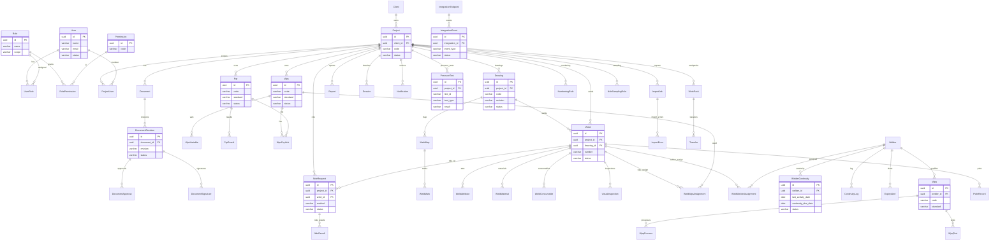

# ERD (Mermaid)

```mermaid
erDiagram
  User ||--o{ UserRole : has
  Role ||--o{ UserRole : assigned
  Role ||--o{ RolePermission : grants
  Permission ||--o{ RolePermission : in
  Project ||--o{ ProjectUser : scopes
  User ||--o{ ProjectUser : member
  Client ||--o{ Project : owns
  Project ||--o{ Document : has
  Document ||--o{ DocumentRevision : revisions
  DocumentRevision ||--o{ DocumentApproval : approvals
  DocumentRevision ||--o{ DocumentSignature : signatures
  Project ||--o{ Wps : uses
  Project ||--o{ Pqr : uses
  Wps ||--o{ WpsVariable : vars
  Pqr ||--o{ PqrResult : results
  Wps ||--o{ WpsPqrLink : link
  Pqr ||--o{ WpsPqrLink : link
  Welder ||--o{ Wpq : qualifies
  Wpq ||--o{ WpqProcess : processes
  Wpq ||--o{ WpqTest : tests
  Project ||--o{ Drawing : drawings
  Drawing ||--o{ WeldMap : map
  WeldMap ||--o{ WeldMark : marks
  Drawing ||--o{ Weld : welds
  Project ||--o{ Weld : welds
  Weld ||--o{ WeldAttribute : attrs
  Weld ||--o{ WeldMaterial : materials
  Weld ||--o{ WeldConsumable : consumables
  Weld ||--o{ VisualInspection : inspections
  Weld ||--o{ WeldWpsAssignment : wps_assign
  Weld ||--o{ WeldWelderAssignment : welder_assign
  Wps ||--o{ WeldWpsAssignment : used
  Welder ||--o{ WeldWelderAssignment : assigned
  Welder ||--o{ WelderContinuity : continuity
  Welder ||--o{ ContinuityLog : log
  Welder ||--o{ ExpiryAlert : alerts
  Project ||--o{ Report : reports
  Project ||--o{ Dossier : dossiers
  Project ||--o{ Notification : notices
  Project ||--o{ NdeRequest : nde
  NdeRequest ||--o{ NdeResult : nde_results
  Weld ||--o{ NdeRequest : nde_on
  Weld ||--o{ PwhtRecord : pwht
  Project ||--o{ PressureTest : pressure_tests
  Project ||--o{ ImportJob : imports
  ImportJob ||--o{ ImportError : import_errors
  Project ||--o{ NumberingRule : numbering
  IntegrationEndpoint ||--o{ IntegrationEvent : events
  Project ||--o{ WorkPack : workpacks
  WorkPack ||--o{ Traveler : travelers
  Project ||--o{ NdeSamplingRule : sampling

  User {
    uuid id PK
    varchar name
    varchar email
    varchar status
  }
  Role {
    uuid id PK
    varchar name
    varchar scope
  }
  Permission {
    uuid id PK
    varchar code
  }
  Project {
    uuid id PK
    uuid client_id FK
    varchar code
    varchar status
  }
  DocumentRevision {
    uuid id PK
    uuid document_id FK
    varchar revision
    varchar status
  }
  Wps {
    uuid id PK
    varchar code
    varchar standard
    varchar status
  }
  Pqr {
    uuid id PK
    varchar code
    varchar standard
    varchar status
  }
  Wpq {
    uuid id PK
    uuid welder_id FK
    varchar code
    varchar standard
  }
  Drawing {
    uuid id PK
    uuid project_id FK
    varchar code
    varchar revision
    varchar status
  }
  Weld {
    uuid id PK
    uuid project_id FK
    uuid drawing_id FK
    varchar number
    varchar status
  }
  WelderContinuity {
    uuid id PK
    uuid welder_id FK
    date last_activity_date
    date continuity_due_date
    varchar status
  }
  NdeRequest {
    uuid id PK
    uuid project_id FK
    uuid weld_id FK
    varchar method
    varchar status
  }
  PressureTest {
    uuid id PK
    uuid project_id FK
    varchar line_id
    varchar test_type
    varchar result
  }
  IntegrationEvent {
    uuid id PK
    uuid integration_id FK
    varchar event_type
    varchar status
  }
```
